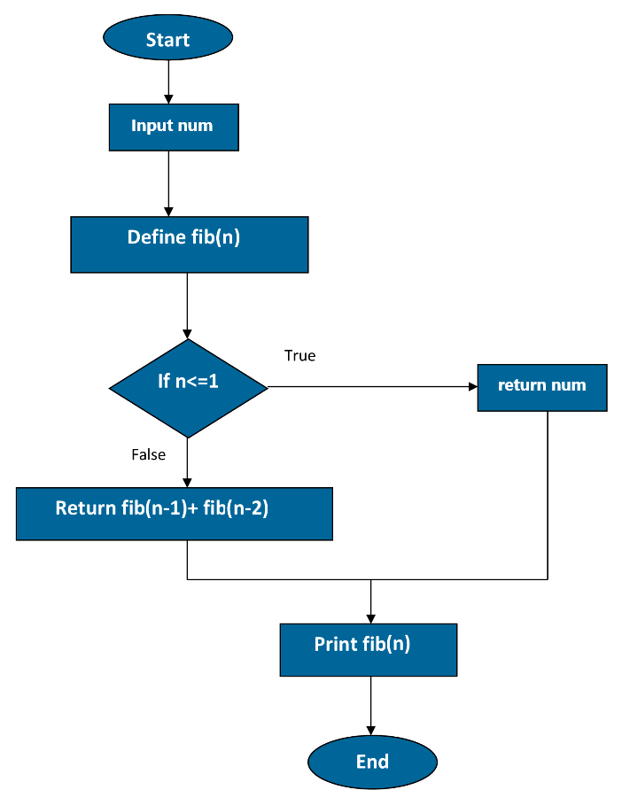
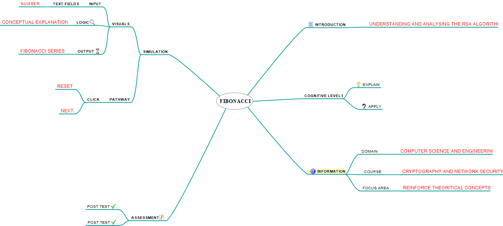

## Storyboard (Round 2)

Experiment 1: Write a C program of fibonacci series.

### 1. Story Outline:
Fibonacci series is a sequence, commonly denoted F(n), such that each number is the sum of the two preceding ones, starting from 0 and 1. 
F(0)=0, F(1)=0 
and 
F(n)=F(n-1)+F(n-2) 
for n > 1. 
The beginning of the sequence is thus: 
0,1,1,2,3,5,8,13,21,34,55,89,144,......

### 2. Story:
In this simulator program the user provides the input and it will generate its fibonacci series. The user will enter the number and presses the start button.When the start button is pressed it calls the fibonacci function which calculates the fibonacci of a number through recursion process and finally returns the fibonacci series of the entered number to the user. 
1.Click on next button until an input field appears on the window. 
2.Enter the value in the given range. 
3.Click on start button to start the execution of the program. 
4.Click on next button to see which line of code is getting executed at that point. 
5.After the program gets executed completely click the reset button to clear the window to test for new value. 

#### 2.1 Set the Visual Stage Description:
The simulator is divided into three parts. 
First part consists of an input field and three buttons(start, next, reset). 
Second part has the step execution. 
Third part is the output block. 
First the user will input the number for which he wants the series to be printed then the user clicks on the next button and he will be able to see which line of code is getting executed at that point and will understand the concept of recursion.
If he wants he can reset the simulator at any point.

#### 2.2 Set User Objectives & Goals:
1.The user will be able to understand the concept of recursion and will be able to apply the recursion concept. 
2.The simulator usually shows every step so that user may better understand the logic behind the process. 
3.To display different scenarios on choosing different values of num. 
4.To answer the assessment based on the observations.

#### 2.3 Set the Pathway Activities:
1.Click on Next button until the variable is declared. 
2.User has to provide a number within a given range in the text box provided. 
3.Click Start and the entered value of num will be displayed. 
4.Click Next button to execute the fibonacci program line by line. 

##### 2.4 Set Challenges and Questions/Complexity/Variations in Questions:

Q1.What will be the length of fibonacci series if the number entered by the user is n? 
a.)n+1 
<b>b.)n </b>
c.)n*n 
d.)n/2 
 
Q2. What is the first three-digit square number that appears on the list of Fibonacci numbers? 
a.)121 
b.)169 
c.)100 
<b>d.)144</b> 

##### 2.5 Allow pitfalls:
1.The simulator is designed for a particular range of numbers so the user needs to be attentive while choosing the numbers to display the series. 
2.The user has the great opportunity to learn about the concept of recursion. 

##### 2.6 Conclusion:
Describe conclusion here : (guide: This may include displaying: how much time did the user take to solve the questions/ How many questions were right?/ How many hints did the learner use. Based on this the evaluation/marking to be suggested to the user. (once he is towards the completion of the experiment, what LO he is taking along with him, what will be his probable, interpretation/conclusion , descriptive) )

##### 2.7 Equations/formulas: NA
F(0)=0, F(1)=0 
and 
F(n)=F(n-1)+F(n-2) 
for n > 1

### 3. Flowchart 4
 

### 4. Mindmap:

 Link to mindmap here : Store the mindmap in both .mm & .png extension in the  /mindmap folder and include link of only .pdf verison here
  
 (guide : An elaborate mind map (connecting all the points in the experiment flow ) should be prepared and submitted by the lab proposer. The mind map should be a clear and detailed document that takes into account all minute intri5acies involved in the development of virtual lab. The mindmap should be self-content and any developer across the globe should be able to code it with all those details. using only FreeMind http://freemind.sourceforge.net/wiki/index.php/Main_Page (send the .png file and also the original .mm extension project file. )

### 5. Storyboard :
Storyboard: <a href="Storyboard/carwiper.gif"> [here]</a>
Link to storybaord (.gif file ) here :
(guide: This document should include sketching and description scene wise (duration, action, description). Software to be used for storyboarding : https://wonderunit.com/storyboarder/ (Its a FOSS tool) . tutorial on how to use it https://www.youtube.com/watch?v=LAeCEpG0KX4
