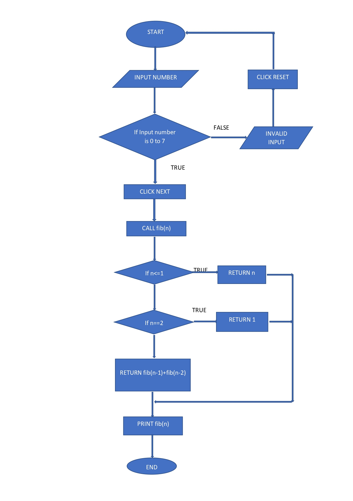

## Storyboard (Round 2)

Experiment 1: Write a C program of fibonacci series.

### 1. Story Outline:
Fibonacci series is a sequence, commonly denoted F(n), such that each number is the sum of the two preceding ones, starting from 0 and 1. 
F(0)=0, F(1)=0 
and 
F(n)=F(n-1)+F(n-2) 
for n > 1. 
The beginning of the sequence is thus: 
0,1,1,2,3,5,8,13,21,34,55,89,144,......

### 2. Story:
This experiment is the implementation of fibonacci series.The Fibonacci sequence first appears in the book Liber Abaci by Fibonacci,where it is used to calculate the growth of rabbit populations.This experiment involves generating a fibonacci series of the number entered by the user. The user enters a number and the program calculates its fibonacci series through recursion.First the program checks if the number is 0 it will return 0, if the number is 1 it will return 1 else it will return fib(number entered-1)+fib(number entered-2) and at this point the program starts calling itself till the function returns 0 or 1.The simulator shows the step by step representation of the the fibonacci program. 

#### 2.1 Set the Visual Stage Description:
The simulator is divided into three parts. 
First part consists of an input field and three buttons(start, next, reset).The input field is for entering the limit till which fibonacci is to be printed.The start button is to start the simulator process.The next button is to execute the next instruction repeatedly.The reset button is used to reset the simulator back to its original state. 
Second part has the step execution display.This part displays the line by line execution of the code for finding the fibonacci series. 
Third part is the output block.The output block shows the end result of each iteration of fibonacci series and finally prints each term of the series. 
First the user will input the number for which he wants the series to be printed then the user clicks on the next button and he will be able to see which line of code is getting executed at that point and will understand the concept of recursion.
If he wants he can reset the simulator at any point.

#### 2.2 Set User Objectives & Goals:
1.The user will be able to understand the concept of recursion and will be able to apply the recursion concept. 
2.The simulator clearly shows every execution step so that the user may better understand the logic behind the process. 
3.To display different scenarios on choosing different values of input. 

#### 2.3 Set the Pathway Activities:
1.Click on start button to start the simulator. 
2.Enter the value in the given range. 
3.Click on next button to start the fibonacci computation process. 
4.Click on next button to see which line of code is getting executed at each step of execution. 
5.After the program gets executed completely click the reset button to clear the window to test for new value. 

##### 2.4 Set Challenges and Questions/Complexity/Variations in Questions:

Q1.What will be the length of fibonacci series if the number entered by the user is n? 
a.)n+1 
<b>b.)n</b> 
c.)n*n 
d.)n/2 
 
Q2. What is the first three-digit square number that appears on the list of Fibonacci numbers? 
a.)121 
b.)169 
c.)100 
<b>d.)144</b> 

##### 2.5 Allow pitfalls:
1.The simulator is designed for a particular range of numbers so the user needs to be attentive while choosing the numbers to display the series. 
2.The user has the great opportunity to learn about the concept of recursion. 

##### 2.6 Conclusion:
1.The fibonacci series is computed and printed according to the given input. 
2.The concept of stack and recursion is to be understood and then applied accordingly. 
3.Assessment/evaluation of the pre-test and post-test should be given immediately to the user. The moment the student clicks on the answer of his choice, the CORRECT ANSWER should be displayed below the question. This would enable the student to understand whether he is right or wrong. 
4.This would prompt the users as to how many answers were correctly answered. 

##### 2.7 Equations/formulas: NA
F(0)=0, F(1)=0 
and 
F(n)=F(n-1)+F(n-2) 
for n > 1

### 3. Flowchart 4
 

### 4. Mindmap:

### 5. Storyboard :

